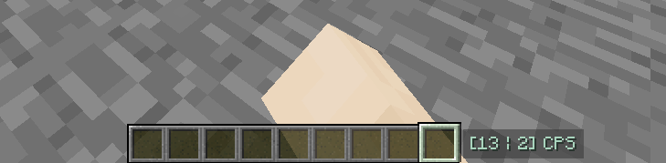
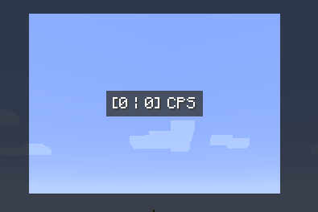
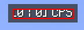
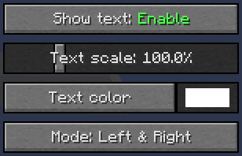
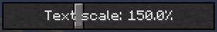
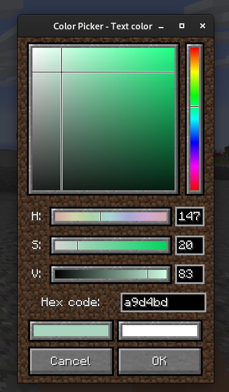
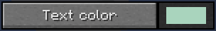
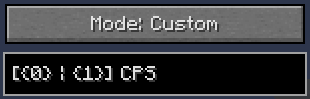
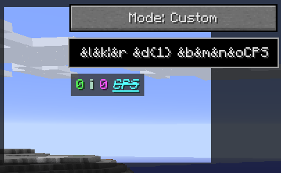

# CPS Display

CPS Display is a forge mod for minecraft 1.8.9 which display your in-game Clicks Per Seconds.

But i like customization, so i tried to make this mod easily customizable.

Ok let's break it down

## Settings GUI

To open the mod settings gui, you can press the "P" key (you can change the key in the `Controls` menu) or type in the chat one of the two commands: `/cpsd` `/cpsdisplay`.

## CPS Display overlay

### Appearance in settings

In settings GUI you still can see how will look the final result.

The background is cut off so you don't need to quit and reopen the menu settings to check if it's looking good or not.

### Move

To move the overlay you just need to click on the text in the settings gui and drag where you want

A red rectangle will show if you can move the overlay

## Text settings

We have 4 buttons

### Show text

This button show or hide the gui overlay.

### Text scale

The scale button can scale to `10.0%` or `400.0%`

If the slider is close to `X50.0%` or `X00.0%`, its value will be rounded to`X50.0%` or `X00.0%` rather than decimal number (like `X49.86%`).

### Text color

By clicking on this button, a new window appears showing us a color picker.

By using this color picker you can easily choose what color you want.

The color selected is showed at the right of the color button.

### Text mode

This button has four different modes:
1. Left
2. Right
3. Left & Right
4. Custom

The most important mode is `Custom`, the others are doing what their name says:

- `Left` show your left clicks per seconds only
- `Right` show your right clicks per seconds only
- `Left & Right` show your left and right clicks per seconds

By selecting `Custom` a text field will appear right above the mode button

You can write `999` characters inside of the textfield, i hope it's enough.

Three important things to know:
1. `{0}` will be replaced by your left clicks
2. `{1}` will be replaced by your right clicks
3. You can use minecraft color code you just need to replace `§` by `&`

So you can do weird things like this with the following text `&a{0}&r &l&k|&r &d{1} &b&m&n&oCPS`

